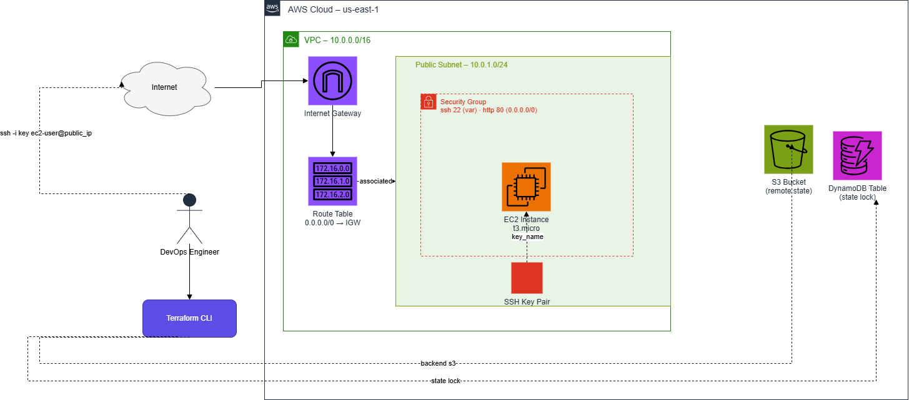
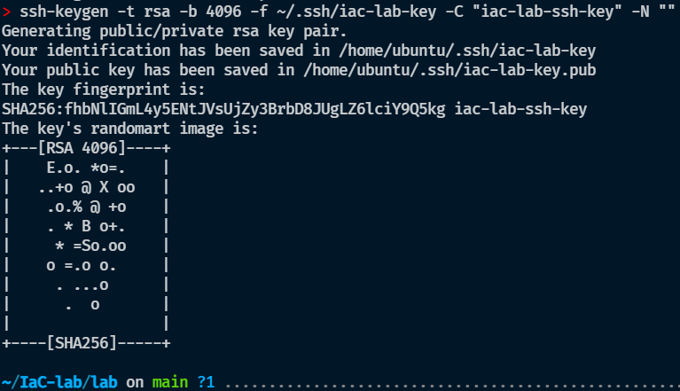
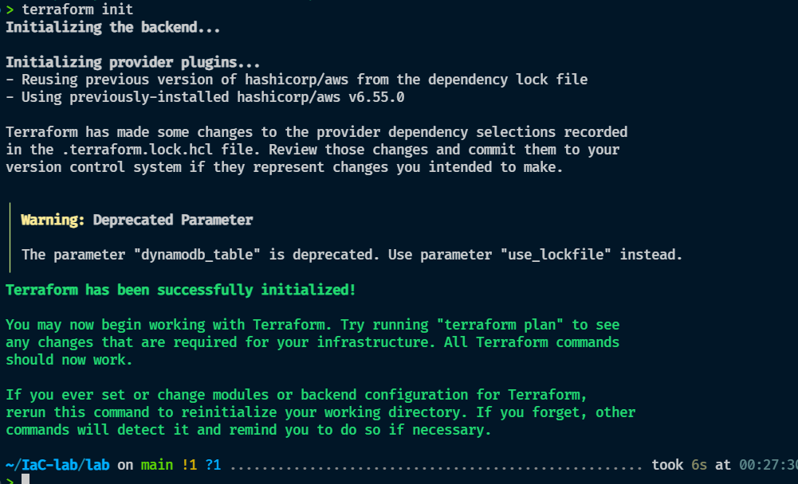
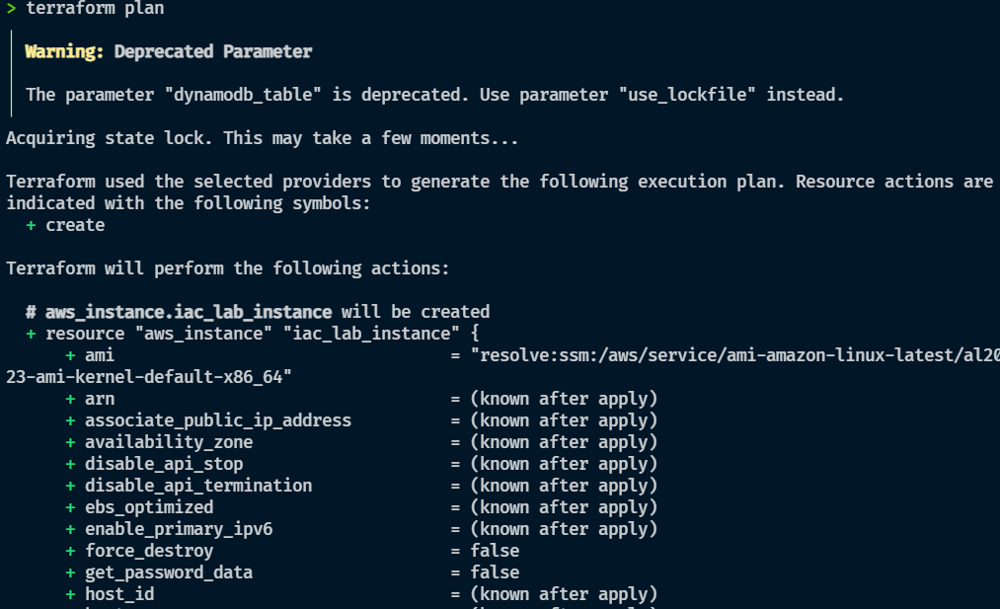
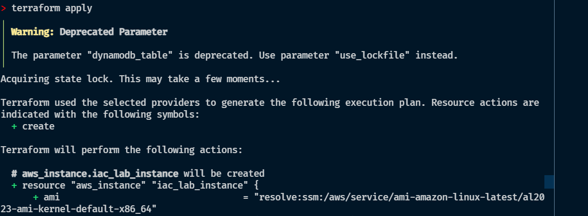
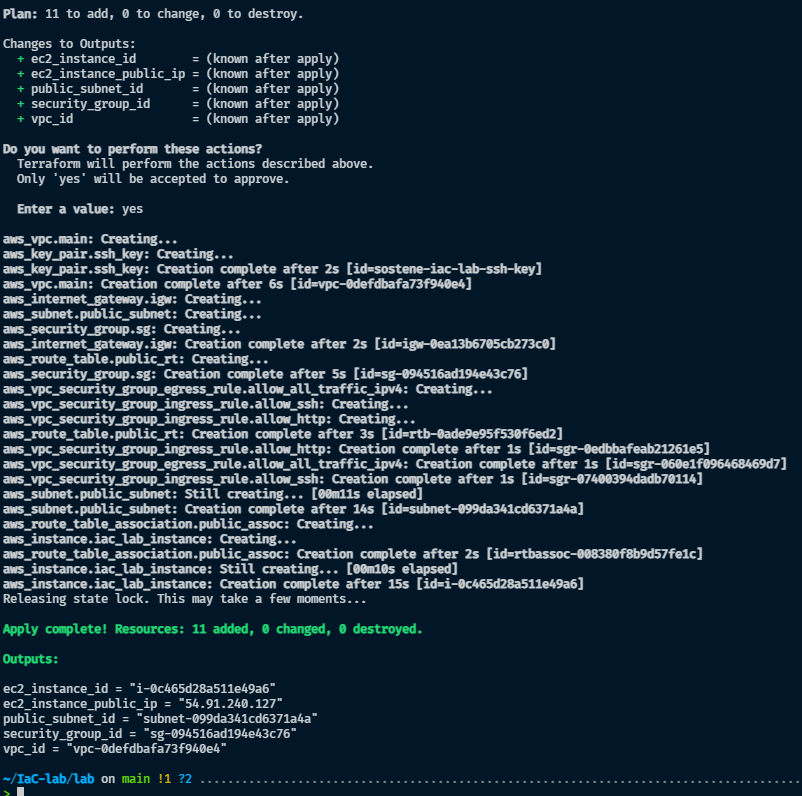
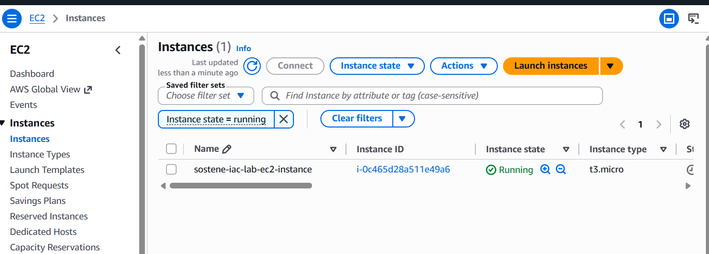
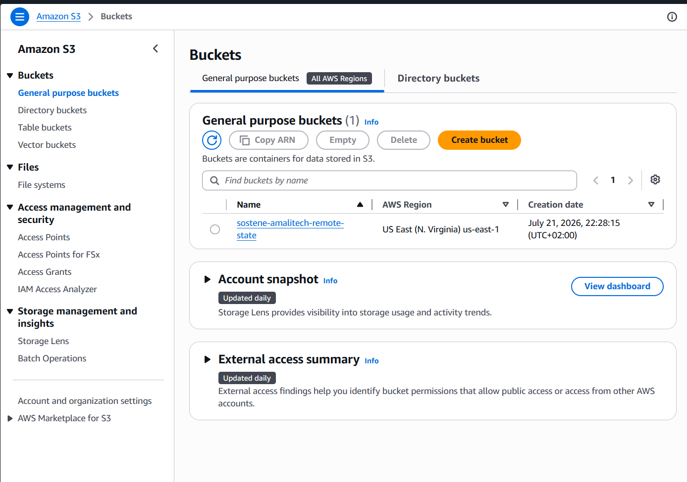

# AWS Foundational Infrastructure with Terraform

Terraform lab: VPC, public subnet, IGW, security group, EC2 instance, with
remote state in S3 and locking via DynamoDB.

## Layout

```
.
├── remote-state/   # creates the S3 bucket + DynamoDB lock table. Apply first, local state.
└── lab/            # VPC, subnet, IGW, SG, EC2. Backend = remote-state/ bucket + table.
```

Two stacks because a backend can't create the bucket it's about to use.
`remote-state/` bootstraps that, once, with local state; `lab/` uses it.

## Architecture



## Resources

| Resource | Notes |
|---|---|
| `aws_vpc.main` | `10.0.0.0/16` |
| `aws_subnet.public_subnet` | `10.0.1.0/24`, public IP on launch |
| `aws_internet_gateway.igw` | + `aws_route_table.public_rt` routing `0.0.0.0/0` |
| `aws_security_group.sg` | SSH (22) from one CIDR, HTTP (80) open, all egress |
| `aws_key_pair.ssh_key` | imports a public key generated locally, not by Terraform |
| `aws_instance.iac_lab_instance` | `t3.micro` |
| `remote-state/`: `aws_s3_bucket`, `aws_dynamodb_table` | versioned, AES-256, `prevent_destroy` |

Resource addresses and `Name` tags follow `${var.tag_name_prefix}-<type>`
consistently (`-vpc`, `-igw`, `-sg`, `-ssh-key`, ...).

`t3.micro` is used instead of the requested `t2.micro` — not offered in this
account/region. Change `var.instance_type` if yours supports it.

## Prerequisites

- Terraform 1.5+
- AWS CLI profile with VPC/EC2/S3/DynamoDB permissions

## 1. SSH key

```bash
ssh-keygen -t rsa -b 4096 -f ~/.ssh/iac-lab-key -C "iac-lab-ssh-key" -N ""
```

Only the `.pub` file is used, via `var.public_key_path` in `lab/`. The private
key never touches Terraform or state.

## 2. Bootstrap backend

```bash
cd remote-state
terraform init && terraform plan && terraform apply
```

## 3. Deploy

```bash
cd ../lab
terraform init
terraform apply -var="my_ip_address_with_cidr=$(curl -s ifconfig.me)/32"
```

`my_ip_address_with_cidr` defaults to `0.0.0.0/0` so the config plans without
input — always override it at apply time, or SSH is open to the world.

## 4. Verify

Console: VPC, subnet, IGW, route table, security group, EC2 instance — names
match the `${var.tag_name_prefix}-*` pattern above. Outputs give you the IDs
and public IP directly.

## 5. Destroy

```bash
cd lab && terraform destroy -var="my_ip_address_with_cidr=$(curl -s ifconfig.me)/32"
cd ../remote-state && terraform destroy   # only if you're done for good
```

The bucket/table have `prevent_destroy` — remove that lifecycle block first
if you actually want them gone.

## Issues hit

- `t2.micro` unavailable in this account → switched to `t3.micro`.
- Generating the key pair in Terraform (`tls_private_key`) put the private
  key in state → moved key generation out to `ssh-keygen`, Terraform only
  imports the public key.
- Backend can't bootstrap itself → split into `remote-state/` + `lab/`.
- Inconsistent resource/tag naming made console lookups slower → standardized
  on `${var.tag_name_prefix}-<type>`.

## Screenshots

**SSH key generation**


**`terraform init` against the S3 backend**


**`terraform plan`**


**`terraform apply`**



**EC2 instance running**


**S3 remote state bucket**


## Security

- Private key never enters Terraform or state.
- `*.pem`, `*.pub`, `*.tfvars`, `*.tfstate*`, `.terraform/` gitignored.
- SSH restricted to a `/32`; HTTP open by design.
